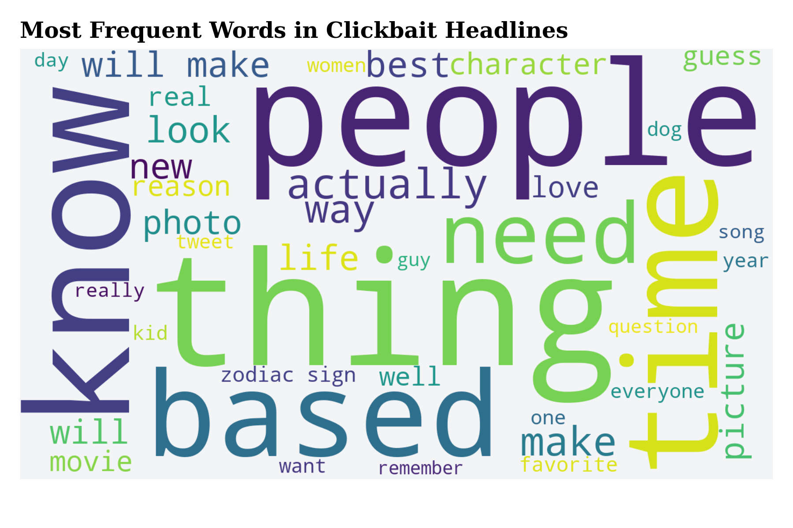
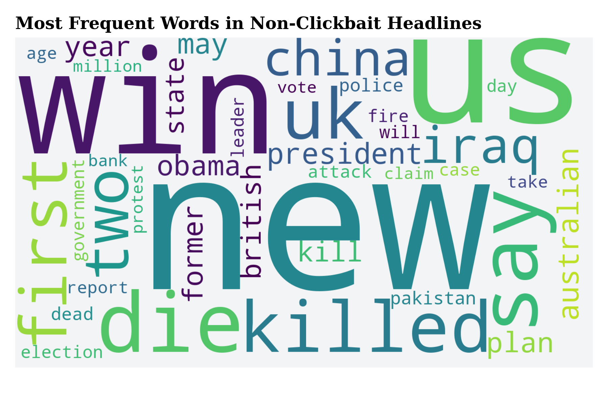
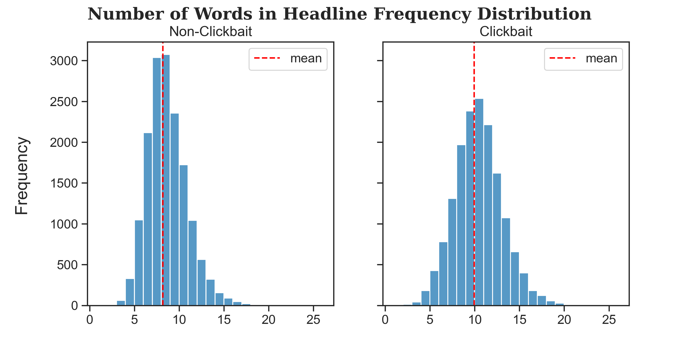
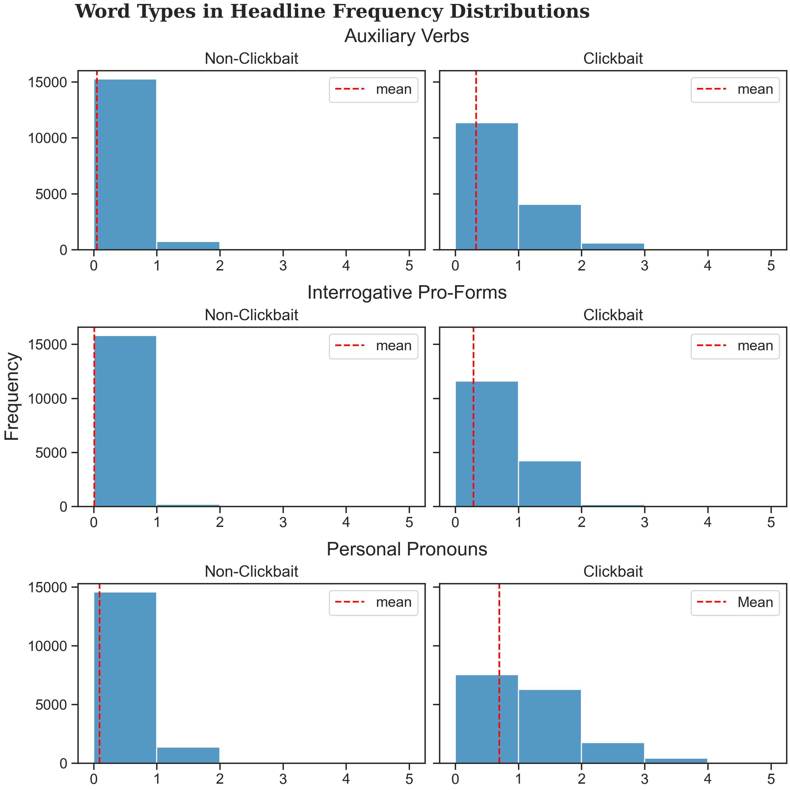

# Using Natural Language Processing to Detecting Clickbait in Headlines—A Machine Learning Case Study

Clickbait headlines are becoming the norm on many platforms exacerbating the user experience, especially with the rise of fake news. The purpose of this project was to classify textual news headlines as clickbait using natural language processing.

To build our machine learning model we used Python and the [NLTK (Natural Language Toolkit)](https://www.nltk.org/). We used a [Kaggle dataset](https://www.kaggle.com/amananandrai/clickbait-dataset) that categorized headlines as *clickbait* from websites such as BuzzFeed and headlines as *non-clickbait* from sources such as The New York Times.

This group work was in collaboration with [Clemens S. Heithecker](https://github.com/clemensheithecker) and was part of a Decisions Support Systems course at [Tilburg University](https://www.tilburguniversity.edu/) in the Netherlands.

## Data Exploration

Before building our classification models, we explored our data by drawing a word cloud of the most occurring words in clickbait headlines.

    

    

    

    
</p

Find a detailed implementation of the exploratory data analysis and visualizations in `data_exploration.ipynb` or `data_exploration.html`.

## Headline Classification

To classify headlines as clickbait and non-clickbait, we developed two supervised machine learning models:

1. We used the most frequently occurring words in headlines to train our model thereby varying the number of top words to include in the model.
2. Using the insights gained from our data exploration, we developed more granular features such as different word types, word sentiment, and word count in headlines.

We first tokenized the headlines, removed punctuation and special characters, converted all characters to lowercase, and removed meaningless stop-words. However, we kept certain stop words in our model that we hypothesized to only occur in clickbait headlines. Then, we randomized the headlines and divided them into a training and testing set. We used the training set to train our model using Naive Bayes and Decision Tree classification models.

### Model Accuracy

The following table shows average accuracy results of the *first model*:

| n    | model         | accuracy | time (s) |
|------|---------------|----------|----------|
| 10   | Naive Bayes   | 81%      | 0.3      |
| 10   | Decision Tree | 81%      | 5.1      |
| 100  | Naive Bayes   | 90%      | 2.5      |
| 100  | Decision Tree | 90%      | 220      |
| 1000 | Naive Bayes   | 96%      | 25       |
| 1000 | Decision Tree | 93%      | 4879     |

where *n* is the number of top most frequent words (e.g. top 10 most frequent words).

The average accuracy scores of the *second model* were as follows:

| model         | accuracy | time (s) |
|---------------|----------|----------|
| Naive Bayes   | 79%      | 0.16     |
| Decision Tree | 79%      | 1.16     |

The first model resulted in higher accuracy scores, especially when increasing the number of top words used in headlines. However, the computational time to run the algorithms was significantly longer compared to our alternative classification model. On average, the choice of algorithm did not affect the accuracy scores but running the Decision Tree algorithm took significantly longer compared to the Naive Bayes classifier.

Find a detailed implementation of the machine learning models in `headline_classification.ipynb` or `headline_classification.html`.

## References

We used data from the following sources:

Anand, A. (April 18, 2020). *Clickbait Dataset* (Version 1) [Dataset]. Retrieved November 23, 2021 from [https://www.kaggle.com/amananandrai/clickbait-dataset](https://www.kaggle.com/amananandrai/clickbait-dataset).

Nielsen, F. Å. (2015). *AFINN-en-165* [Dataset]. Retrieved December 1, 2021 from [https://github.com/fnielsen/afinn/tree/master/afinn/data](https://github.com/fnielsen/afinn/tree/master/afinn/data)

Wikipedia contributors. (2019, April 8). *Category:English interrogative pro-forms - Wiktionary*. Wikipedia. Retrieved December 3, 2021, from [https://en.wiktionary.org/wiki/Category:English_interrogative_pro-forms](https://en.wiktionary.org/wiki/Category:English_interrogative_pro-forms)

Wikipedia contributors. (2021a, October 22). *Auxiliary verb*. Wikipedia. Retrieved December 3, 2021, from [https://en.wikipedia.org/wiki/Auxiliary_verb](https://en.wikipedia.org/wiki/Auxiliary_verb)

Wikipedia contributors. (2021b, November 15). *English personal pronouns*. Wikipedia. Retrieved December 3, 2021, from [https://en.wikipedia.org/wiki/English_personal_pronouns](https://en.wikipedia.org/wiki/English_personal_pronouns)
